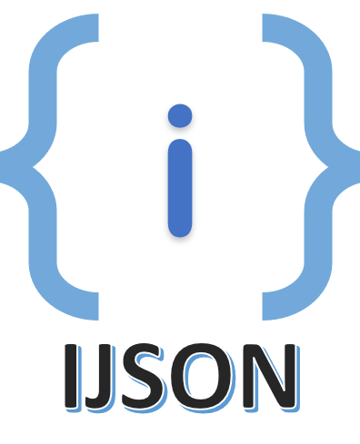

<p align="center">
    
    <br>
    <a href="https://pkg.go.dev/github.com/akshaybharambe14/ijson">
        
    </a>
    <br>
    Query interface data and set or delete values easily
</p

IJSON is a small but effective utility for dealing with dynamic or unknown JSON structures in [Go](https://golang.org). It's a helpful wrapper for navigating hierarchies of `map[string]interface{}` OR `[]interface{}`. It is the best solution for one time data access and manipulation.

Other libraries parse the whole json structure in the required format, not suitable if you have `interface{}` as input and want the output in same format.

> **Note** - This is not a json parser. It just plays with raw interface data.

## Features

- Very fast in accessing and manipulating top level values.
- Avoids parsing whole JSON structure to intermediate format. Saves allocations.
- Easy API to perform **query**, **set** or **delete** operations on raw interface data.
- **One line syntax** to chain multiple operations together.

## Known limitations

- Not suitable if you want to perform multiple operations on same data.

## Getting started

### Installation

```sh
go get -u github.com/akshaybharambe14/ijson
```

### Usage and Example

This package provides two types of functions. The functions suffixed with `<action>P` accept a path separated by `"."`.

Ex. "#0.friends.#~name"

```go
package main

import (
	"fmt"

	"github.com/akshaybharambe14/ijson"
)

var data = []interface{}{
	map[string]interface{}{
		"index": 0,
		"friends": []interface{}{
			map[string]interface{}{
				"id":   0,
				"name": "Justine Bird",
			},
			map[string]interface{}{
				"id":   0,
				"name": "Justine Bird",
			},
			map[string]interface{}{
				"id":   1,
				"name": "Marianne Rutledge",
			},
		},
	},
}

func main() {
	r := ijson.New(data).
		GetP("#0.friends.#~name"). // list the friend names for 0th record -
		// []interface {}{"Justine Bird", "Justine Bird", "Marianne Rutledge"}

		Del("#0"). // delete 0th record
		// []interface {}{"Marianne Rutledge", "Justine Bird"}

		Set("tom", "#") // append "tom" in the list
		// []interface {}{"Marianne Rutledge", "Justine Bird", "tom"}

	fmt.Printf("%#v\n", r.Value())

	// returns error if the data type differs than the type expected by query
	fmt.Println(r.Set(1, "name").Error())
}

```

### Path syntax

ijson follows a specific path syntax to access the data. The implementation sticks to the analogy that, user knows the path. So if caller wants to access an index, the underlying data must be an array otherwise, an error will be returned.

Use functions and methods suffixed by `P` to provide a `"."` separated path.

Consider following data as an example.

```go
var data = []interface{}{
	map[string]interface{}{
		"index": 0,
		"friends": []interface{}{
			map[string]interface{}{
				"id":   0,
				"name": "Justine Bird",
			},
			map[string]interface{}{
				"id":   0,
				"name": "Justine Bird",
			},
			map[string]interface{}{
				"id":   1,
				"name": "Marianne Rutledge",
			},
		},
	},
}
```

#### Get values

##### Get from Array

1. Get data at `0th` index

   ```go
   ijson.Get(data, "#0")
   ```

2. Get all names from friends array

   ```go
   ijson.Get(data, "#0", "#~name")
   ```

3. Get length of an array

   ```go
   ijson.Get(data, "#")
   ```

##### Get from Object

1. Access a key from object

   ```go
   ijson.Get(data, "#0", "index")
   ```

#### Set

Set overwrites the existing data. An error will be returned if the data does not matched the query. If the data is `nil`, it will create the structure.

There is an alternative for datatype mismatch. Use `SetF` instead of `Set` function. It will replace the existing with provided.

##### Set in Array

1. Set at `1st` index

   ```go
   ijson.Set(data, value, "#1")
   ```

2. Append data to the array

   ```go
   ijson.Set(data, value, "#")
   ```

##### Set in Object

1. Set data against `name` key

   ```go
   ijson.Set(data, value, "name")
   ```

#### Delete

##### Delete from Array

1. Delete at index `#2` **without preserving the order**
   Returns an error if index is out of range.

   ```go
   ijson.Del(data, "#2")
   ```

2. Delete at index `#2` **with preserving the order**
   Returns an error if index is out of range.

   ```go
   ijson.Del(data, "#~2")
   ```

3. Delete last element

   ```go
   ijson.Del(data, "#")
   ```

##### Delete from Object

1. Delete `name` key

   ```go
   ijson.Del(data, "name")
   ```

### Operations chaining

You can chain multiple operations and check if it succeeds or fails.

```go
    r := ijson.New(data).Get("#0", "friends", "#~name").Del("#0").Set(value, "#")
    if r.Error() != nil {
        ...
    }

    // access value
    _ = r.Value()
```

### Parsing the json

This package does not provide the ability to parse json into interface data. Perhaps, we already have a very wide range of json parsers. I would recommend [GJSON](https://https://github.com/tidwall/gjson). It is probably the fastest, as far as I know. Else, you can always go with the standard library.

Please check following awesome projects, you might find a better match for you.

1. [GJSON](https://github.com/tidwall/gjson), [SJSON](https://github.com/tidwall/sjson)
2. [FASTJSON](https://github.com/valyala/fastjson)
3. [GABS](https://github.com/Jeffail/gabs)

## Contact

Akshay Bharambe [@akshaybharambe1](http://twitter.com/akshaybharambe1)

## License

IJSON source code is available under the MIT [License](/LICENSE).
